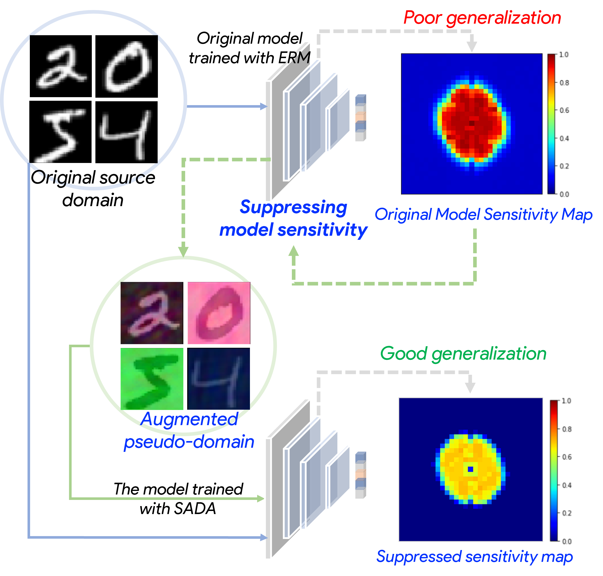

# Spectral Adversarial Data Augmentation (SADA)

[-blue.svg)](https://github.com/996icu/996.ICU/blob/master/LICENSE)
[](https://996.icu)

This repository includes open-source codes, detailed experimental results and full references of our AAAI 2023 work 

[*When Neural Networks Fail to Generalize? A Model Sensitivity Perspective*](https://arxiv.org/abs/2212.00850).

## Overview

<p align='center'></p>

The figure above summarizes our algorithm comparisons framework, *Spectral Adversarial Data Augmentation*.
- First, our method computes [model sensitivity map](https://github.com/DIAL-RPI/Spectral-Adversarial-Data-Augmentation/tree/main/AAAIcodeSubmissoin__model_sensitivity_map) for the ERM model.
- Then, we run [SADA](https://github.com/DIAL-RPI/Spectral-Adversarial-Data-Augmentation/tree/main/AAAIcodeSubmissoin__SADA) to generate the augmented data and train the model with the JS-div regularization.

## Prerequisites

- Python 3.8
- PyTorch 1.8.1+
- A computing device with GPU

## Getting started

### Installation

- (Not necessary) Install [Anaconda3](https://www.anaconda.com/products/distribution)
- Install [CUDA 11.0+](https://developer.nvidia.com/cuda-11.0-download-archive)
- Install [PyTorch 1.8.1+](http://pytorch.org/)

Noted that our code is tested based on [PyTorch 1.8.1](http://pytorch.org/)

### Dataset & Preparation

All datasets used in our work are publicly available.
In our experiments, we followed the data precrossing in the [RandConv](https://github.com/wildphoton/RandConv/).

### Measure the sensitivity map of an ERM model

Train and evaluate an ERM model by

```bash
python ./AAAIcodeSubmissoin__model_sensitivity_map/train_ERM.py
```

The model will be saved in `./AAAIcodeSubmissoin__model_sensitivity_map/save_dir`.


Measure the sensitivity map of an ERM model by

```bash
python ./AAAIcodeSubmissoin__model_sensitivity_map/model_sensitivity_map.py
```

If you want to try SADA directly, __a example of model sensitivity map__ of an ERM model trained on DIGTS dataset is provided as in 

```
./AAAIcodeSubmissoin__model_sensitivity_map/sample/sample_map.pth
```

### Train model with Spectral Adversarial Data Augmentation (SADA)

Train and evaluate the models with SADA by

```bash
python ./AAAIcodeSubmissoin__SADA/train_SADA.py
```

The key __SADA data augmentation module__ is in 

```
./AAAIcodeSubmissoin__SADA/sada.py
```

Augmentation settings for all datasets:

- `--epsilon` iteration of the checkpoint to load. #Default: 0.2
- `--step_size` step size of the adversarial attack on the amplitude spectrum. #Default: 0.08
- `--num_steps` batch size of the attack steps. #Default: 5
- `--tau` settings for the early stop acceleration. #Default: 1
- `--random_init` if or not initializing amplitude spertrums with random perturbations. #Default: True
- `--randominit_type` type of random init type. #Default: 'normal'
- `--criterion` loss functions to attack. #Default: 'ce', choices=['ce', 'kl']
- `--direction` neg: standard attack || pos:inverse attack. #Default: neg, choices=['pos','neg']

## Citation

Please cite these papers in your publications if it helps your research:

```bibtex
@article{zhang2022neural,
  title={When Neural Networks Fail to Generalize? A Model Sensitivity Perspective},
  author={Zhang, Jiajin and Chao, Hanqing and Dhurandhar, Amit and Chen, Pin-Yu and Tajer, Ali and Xu, Yangyang and Yan, Pingkun},
  journal={arXiv preprint arXiv:2212.00850},
  year={2022}
}
```

## Acknowledgement

We directly adopt some codes from the previous works as below:

- [AugMix](https://github.com/google-research/augmix)
- [AugMax](https://github.com/VITA-Group/AugMax)
- [GUD](https://github.com/ricvolpi/generalize-unseen-domains)
- [M-ADA](https://github.com/joffery/M-ADA)
- [RandConv](https://github.com/wildphoton/RandConv/)

We would like to thank these authors for sharing their codes.
